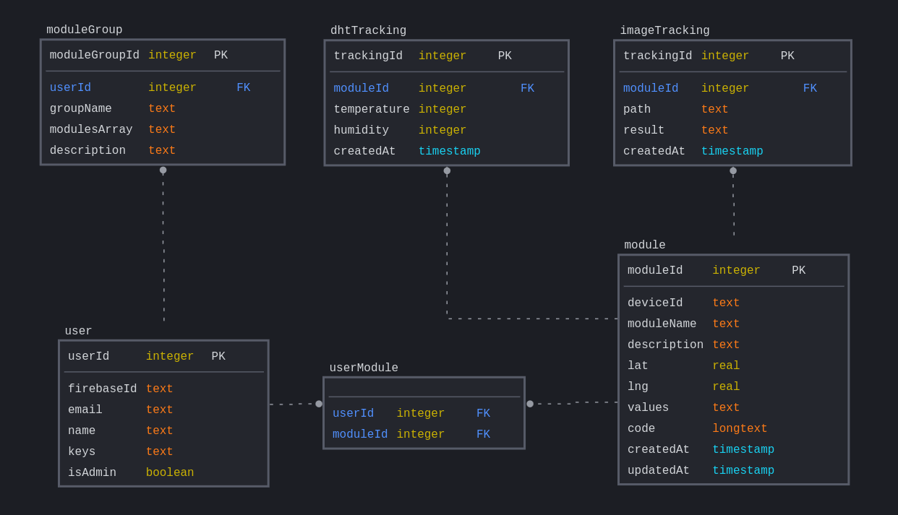

# AMS BACKEND SERVER v2

## Features

1. user account
2. module groups
3. communicate back and forth with user account
4. iot rpi camera setup
5. update db with images
6. classify image
7. alert user with email or native notifications
8. track humidity and temperature

## SQL Table Mapping



generated from https://sqldbm.com

data in the modules table will store values such as battery and latest dht values and so on...

```
module.data = {
    deviceType: "rpi" | "esp",
    battery: 42,
    lat: 11.2343,
    lng: 24.1876,
    values: {
        temperature: 28.0,
        humidity: 40,
        path: ".../xxx.png"
    },
}
```

using modulesArray is a bad idea but im doing it for the sake of simplicity because reality wise there will not be that many devices inside one group..
